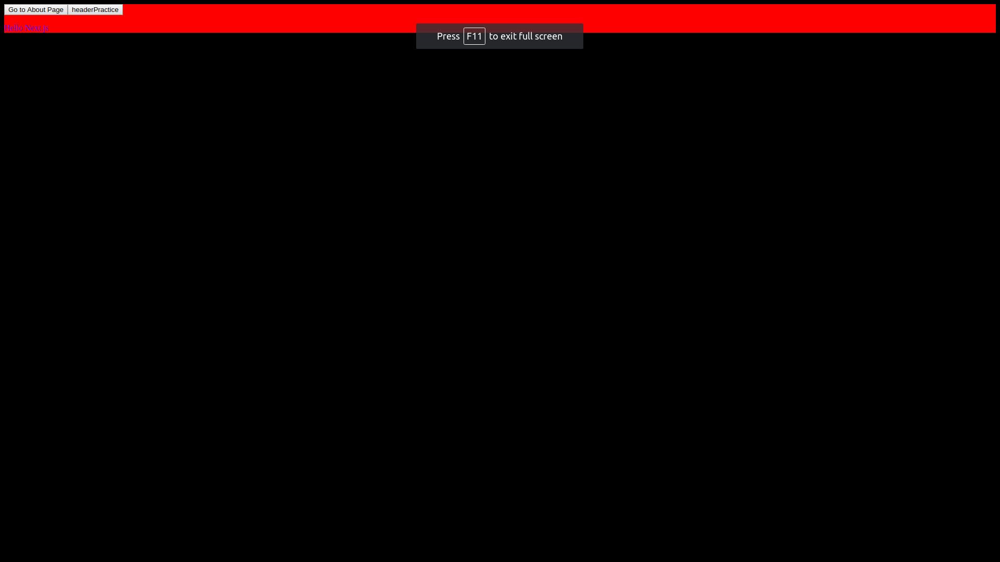

# My Awesome Project
Practicing Next.js


## How It's Made:
This Application is made with Next.js!

## Optimizations.
I would like to style this better probably use Bootstrap and actually use a npm package called Postmark and receive a email when onClick.


## Lessons Learned:
Navigate between pages, using shared components, creating dynamic pages, clean urls with route masking, fetching data for components, styling components

In practice, I usually need to fetch data from a remote data source. Next.js comes with a standard API to fetch data for pages. I did it using an async function called getInitialProps.
 ```const Page = ({ stars }) =>
   <div>
     Next stars: {stars}
   </div>;

 Page.getInitialProps = async ({ req }) => {
   const res = await fetch('https://api.github.com/repos/zeit/next.js');
   const json = await res.json();
   return { stars: json.stargazers_count };
 };

 export default Page;
```

I used a GITHUB api to  fetch(''); the amount of starts for MY BoardsCommissionsForm APP on GITHUB!

https://github.com/JOHNFLEURIMOND/BoardsCommissionsForm

## Installation
1. Clone repo
2. run `npm install`

## Usage
1. run `npm run dev`
2. Navigate to `localhost:3000`
