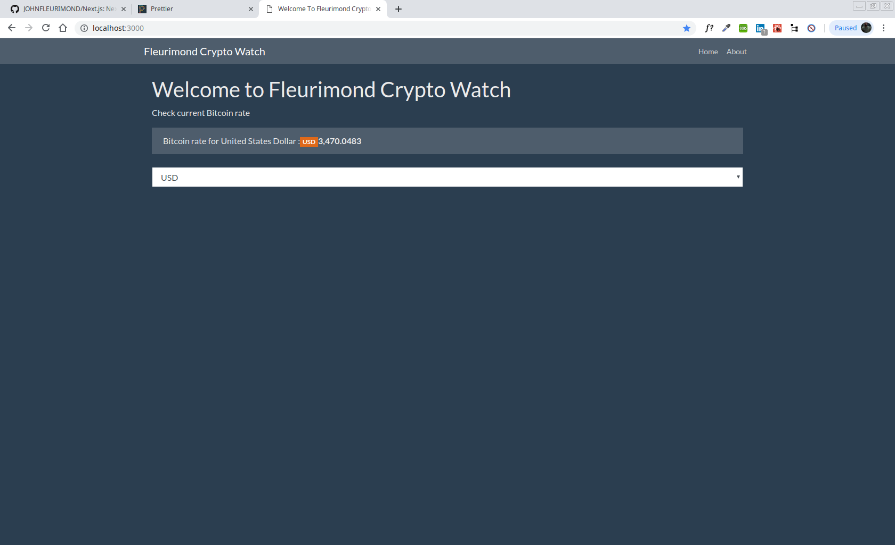

# My Awesome Project
Practicing Next.js and build a simple application that pulls Bitcoin pricing from an API and displays it in the app.

## How It's Made:
This Application is made with Next.js!

## Optimizations.
More Crypto Listed

## Lessons Learned:
Will update.

## Installation
1. Clone repo
2. run `npm install`

## Usage
1. run `npm run dev`
2. Navigate to `localhost:3000`
